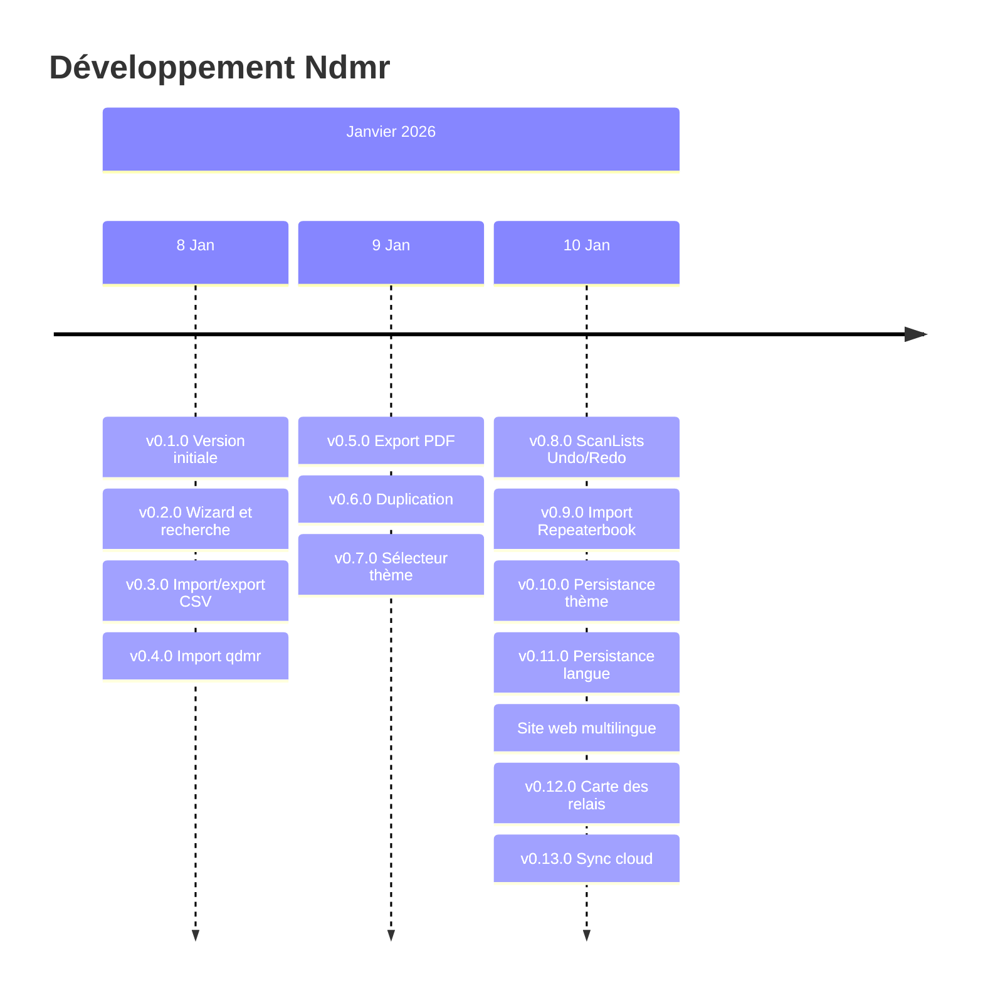

# Timeline Ndmr

> Historique chronologique du développement

## 2026

### 10 Janvier 2026 - Site web ndmr.app

**Sprint Web** - Création du site vitrine multilingue

#### Fonctionnalités

| Fonctionnalité | Description |
|----------------|-------------|
| Site statique | Landing page moderne avec hero, features, screenshots, radios supportées |
| Infrastructure AWS | Terraform pour S3 + CloudFront + ACM (HTTPS) |
| Design responsive | Thème clair/sombre automatique, mobile-first |
| Support multilingue | 7 langues (FR, EN, ES, PT, IT, DE, UK) |
| Détection langue | Automatique (URL > localStorage > navigateur) |
| Sélecteur de langue | Dropdown dans la navigation avec drapeaux |

#### Fichiers clés

| Élément | Fichier |
|---------|---------|
| Page principale | `website/index.html` |
| Styles | `website/css/style.css` |
| Internationalisation | `website/js/i18n.js` |
| Infrastructure | `website/infra/main.tf` |
| Déploiement | `website/deploy.sh` |

---

### 10 Janvier 2026 - v0.13.0

**Sprint M** - Synchronisation cloud

#### Fonctionnalités

| Fonctionnalité | Description |
|----------------|-------------|
| Backend FastAPI | API serverless avec AWS Lambda + DynamoDB |
| Authentification | Inscription, connexion, refresh JWT |
| Endpoints CRUD | Création, lecture, mise à jour, suppression de codeplugs |
| Service sync | Gestion des conflits par version |
| Écran Cloud | Liste des codeplugs avec actions sync |
| Écran Login | Formulaire inscription/connexion |
| Navigation | Nouvel onglet Cloud avec raccourci Cmd/Ctrl+7 |

#### Fichiers clés

| Élément | Fichier |
|---------|---------|
| Backend API | `backend/app/main.py` |
| Auth service | `lib/features/cloud/data/services/auth_service.dart` |
| Sync service | `lib/features/cloud/data/services/sync_service.dart` |
| Cloud screen | `lib/features/cloud/presentation/screens/cloud_screen.dart` |

---

### 10 Janvier 2026 - v0.12.0

**Sprint L** - Carte interactive des relais

#### Fonctionnalités

| Fonctionnalité | Description |
|----------------|-------------|
| Carte OpenStreetMap | Affichage des relais DMR sur une carte interactive |
| Marqueurs colorés | Vert = actif, gris = hors service |
| Sélection pays | Filtrage des relais par pays |
| Fiche relais | Détails au clic (fréquence, CC, DMR ID, notes) |
| Import direct | Ajout du relais comme canal en un clic |
| Géolocalisation | Centrage automatique sur la position de l'utilisateur |
| Navigation | Nouvel onglet Carte avec raccourci Cmd/Ctrl+6 |

#### Fichiers clés

| Élément | Fichier |
|---------|---------|
| Écran carte | `lib/features/codeplug/presentation/screens/repeater_map_screen.dart` |
| Service Repeaterbook | `lib/features/codeplug/data/services/repeaterbook_service.dart` |

---

### 10 Janvier 2026 - v0.11.0

**Sprint K** - Persistance langue et confirmation fermeture

#### Fonctionnalités

| Fonctionnalité | Description |
|----------------|-------------|
| Persistance langue | Sauvegarde du choix de langue dans SharedPreferences |
| Sélecteur de langue | Choix Système/English/Français dans les réglages |
| Confirmation fermeture | Dialog avant de quitter si modifications non sauvegardées |

---

### 10 Janvier 2026 - v0.10.0

**Sprint J** - Persistance thème et indicateur modifications

#### Fonctionnalités

| Fonctionnalité | Description |
|----------------|-------------|
| Persistance thème | Sauvegarde du thème dans SharedPreferences |
| Indicateur dirty | Point (•) dans le titre si modifications non sauvegardées |
| Tracking état | hasUnsavedChangesProvider pour suivre les changements |

---

### 10 Janvier 2026 - v0.9.0

**Sprint I** - Import Repeaterbook

#### Fonctionnalités

| Fonctionnalité | Description |
|----------------|-------------|
| Import Repeaterbook | Intégration API Repeaterbook.com |
| Sélection pays | Liste des pays avec relais DMR |
| Filtre ville | Recherche par ville |
| Conversion canaux | Transformation automatique en canaux DMR |

---

### 10 Janvier 2026 - v0.8.0

**Sprint H** - ScanLists et Undo/Redo

#### Fonctionnalités

| Fonctionnalité | Description |
|----------------|-------------|
| ScanLists UI | Interface deux panneaux pour gérer les listes de scan |
| Canal prioritaire | Sélection et réorganisation par drag & drop |
| Undo/Redo | Historique des actions (50 max) |
| Raccourcis | Cmd/Ctrl+Z, Cmd/Ctrl+Shift+Z, Cmd/Ctrl+Y |

---

### 9 Janvier 2026 - v0.7.0

**Sprint G** - Sélecteur thème et drag & drop

#### Fonctionnalités

| Fonctionnalité | Description |
|----------------|-------------|
| Sélecteur thème | Choix clair/sombre/système dans les réglages |
| Réorg contacts | Drag & drop pour réorganiser les contacts |
| Réorg zones | Drag & drop pour réorganiser les zones |
| Stats dashboard | Statistiques détaillées (digital/analog, groups/private) |

---

### 9 Janvier 2026 - v0.6.0

**Sprint F** - Duplication et réorganisation

#### Fonctionnalités

| Fonctionnalité | Description |
|----------------|-------------|
| Duplication contacts | Copie rapide des contacts |
| Duplication zones | Copie rapide des zones |
| Réorg canaux | Drag & drop pour réorganiser les canaux |

---

### 9 Janvier 2026 - v0.5.0

**Sprint E** - Performance et export PDF

#### Fonctionnalités

| Fonctionnalité | Description |
|----------------|-------------|
| Debouncing | Optimisation recherche pour gros codeplugs |
| Duplication canaux | Copie rapide des canaux |
| Export PDF | Génération PDF du codeplug complet |

---

### 8 Janvier 2026 - v0.4.0

**Sprint D** - Import qdmr et raccourcis

#### Fonctionnalités

| Fonctionnalité | Description |
|----------------|-------------|
| Import qdmr | Support des fichiers .yaml de qdmr |
| Recherche contacts | Filtrage par nom et DMR ID |
| Raccourcis clavier | Cmd/Ctrl+O/S, Cmd/Ctrl+1-5 pour navigation |

---

### 8 Janvier 2026 - v0.3.0

**Sprint C** - Import/export CSV et zones

#### Fonctionnalités

| Fonctionnalité | Description |
|----------------|-------------|
| Import CSV | Import de canaux depuis CSV |
| Export CSV | Export de canaux vers CSV |
| Attribution zones | Drag & drop pour attribuer canaux aux zones |
| Validation | Vérification du codeplug avant export |
| Détail zones | Écran de détail avec canaux de la zone |

---

### 8 Janvier 2026 - v0.2.0

**Sprint B** - Wizard et recherche

#### Fonctionnalités

| Fonctionnalité | Description |
|----------------|-------------|
| Wizard | Assistant de première configuration |
| Recherche canaux | Filtrage par nom, fréquence, mode |
| Réglages améliorés | Tooltips sur tous les paramètres |
| Fix ouverture | Correction du chargement de fichiers |

---

### 8 Janvier 2026 - v0.1.0

**Sprint A** - Version initiale

#### Fonctionnalités

| Fonctionnalité | Description |
|----------------|-------------|
| Éditeur codeplug | Gestion canaux, zones, contacts, réglages |
| Sauvegarde JSON | Format .ndmr |
| Multilingue | Support FR/EN |
| Tooltips | Aide contextuelle pour débutants |
| Contacts défaut | France, Europe, Mondial, Echo Test |

---

## Diagramme

---

*Dernière mise à jour : 10 Janvier 2026 (v0.13.0 - Synchronisation cloud des codeplugs)*
